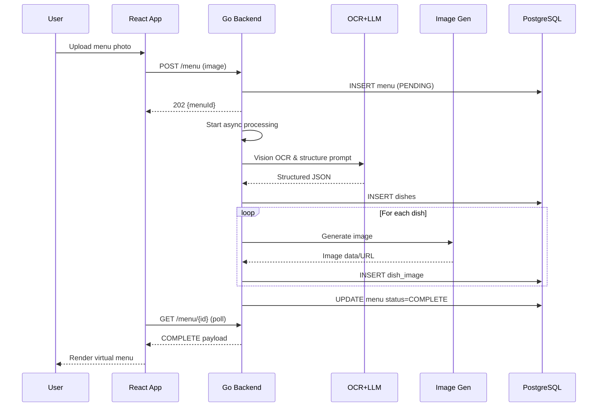

# Software Design Document (SDD)

## 1. Document Control
- Version: 0.1.0 (Draft)
- Owner: Engineering
- Last Updated: 2025-09-10

## 2. Overview
A system that converts a photographed restaurant menu into a structured "virtual menu" (JSON) enriched with dish images. The user supplies a photo via a web UI. The backend performs OCR + semantic structuring using an LLM provider (OpenAI). For each parsed dish, an image is generated via an image generation service and persisted along with normalized menu + dish metadata in PostgreSQL. The client polls for completion and then renders the virtual menu.

## 3. Goals & Success Criteria
### 3.1 Goals
- Extract structured menu data (sections, dishes, prices, descriptions, dietary tags) from a raw photo.
- Provide an API that accepts one menu image and returns a stable menu identifier immediately while processing proceeds asynchronously.
- Enrich each dish with an autogenerated representative image.
- Persist all relevant data (menu, dishes, images) for later retrieval.
- Deliver JSON suitable for rendering without post-processing on the client.

### 3.2 Success Metrics (initial targets)
- Mean OCR+LLM structuring latency: < 25s for a single image (95th percentile < 40s).
- Dish image generation latency (per dish): < 6s p95 (parallelized where possible).
- Accuracy: ≥ 90% correct extraction of dish names vs ground truth test set.
- Uptime (core API): ≥ 99% monthly.

### 3.3 Non-Goals (Phase 1)
- Multi-page menu handling (assume single image).
- Real-time streaming updates (polling only initially).
- User authentication / RBAC (assume anonymous or pre-auth gateway stub).
- Editing / manual correction UI.
- Pricing currency normalization beyond simple pass-through.

## 4. Stakeholders
- End User: Takes photo, views virtual menu.
- Product: Defines required structured fields.
- Engineering: Implements and operates system.
- Future Analytics: Consumes normalized menu data.

## 5. High-Level Architecture
Components:
1. Web Frontend (React): Image upload, status polling, renders structured menu + images.
2. Backend API (Go): HTTP endpoints, orchestrates asynchronous processing, persistence.
3. LLM / OCR Service (OpenAI): Vision + structured output (JSON schema enforced via function calling / response format instructions).
4. Image Generation Service (Sync API): Generates dish images from textual dish descriptions (prompt engineered by backend).
5. PostgreSQL Database: Stores menu metadata, dish records, dish image references (and optionally binary image blobs or object storage URLs).
6. (Future) Object Storage (e.g., S3) for image binaries if size grows beyond practical DB storage.

### 5.1 Data Flow Summary
1. Client POSTs `multipart/form-data` with image to `/menu`.
2. Backend saves original image (temp storage / object storage), creates `menu` row (status=PENDING), returns `{menuId}`.
3. Worker routine triggers: send image to LLM with OCR+structuring prompt.
4. LLM returns structured JSON (sections → dishes → fields).
5. Backend persists dish rows; for each dish, calls image generation API (can be concurrent), stores resulting image.
6. Status transitions: PENDING → PROCESSING → COMPLETE (or FAILED with error reason).
7. Client polls `/menu/{id}` until `status=COMPLETE`; receives full structured payload including image URLs.

## 6. Detailed Component Design

### 6.1 Frontend (React)
- Upload form: single image (jpeg/png, max 10MB configurable).
- On success: store `menuId`; begin polling every 2s (backoff to 5s after 30s elapsed) until COMPLETE/FAILED or max 60s.
- Render states: Idle, Uploading, Processing (progress ring / textual status), Complete (menu grid), Failed (retry option).
- Accessibility: alt text = dish name.

### 6.2 Backend (Go)
Primary responsibilities:
- Request validation & image sanitation.
- Async orchestration (goroutine or job queue abstraction for future scale).
- LLM prompt assembly & response parsing with schema validation.
- Fan-out dish image generation (bounded concurrency via worker pool / semaphore).
- Persistence; idempotency & error handling.

Key packages (proposed):
- `api` (handlers)
- `service/menu` (orchestration logic)
- `provider/llm` (OpenAI client abstraction)
- `provider/imagegen` (dish image generation adapter)
- `store` (repositories: menuRepo, dishRepo, imageRepo)
- `jobs` (future: queue integration)
- `schema` (JSON schema + validation)
- `config`, `logger`, `errors`

Concurrency Controls:
- Bounded parallel image gen: e.g., `maxConcurrentImageJobs = 5`.
- Context with deadline for entire processing pipeline (e.g., 60s soft cap, 90s hard timeout).

Observability:
- Structured logs (JSON) with correlation id = menuId.
- Basic metrics: durations (OCR, image gen aggregate), counts, error rates, queue depth (future).

### 6.3 LLM / OCR
Prompt Strategy:
- Use vision model with instruction: "Extract menu sections; for each dish provide: name, description (optional), price (numeric + currency symbol preserved), tags (vegan, vegetarian, gluten-free, spicy, etc.), and any size/options found. Return JSON strictly matching provided schema." 
- Enforce schema with response formatting features.
Validation:
- JSON schema validation in backend; on failure: attempt single retry with stricter system prompt; else mark FAILED.

### 6.4 Image Generation Service
Input: dish name + concise description + style guidelines (e.g., "overhead photo, natural lighting, appetizing, no text").
Output: base64 image or URL; if base64, backend converts to PNG/JPEG and stores.
Error Handling: up to 2 retries with exponential backoff (e.g., 500ms, 1500ms) per dish.
Fallback: If generation ultimately fails, still return menu; dish image `status=unavailable` with placeholder image URL.

### 6.5 Database (PostgreSQL)
#### Tables (initial)
```
menu (
  id                UUID PK,
  original_image_url TEXT NULL,
  status            TEXT NOT NULL CHECK (status IN ('PENDING','PROCESSING','COMPLETE','FAILED')),
  created_at        TIMESTAMPTZ NOT NULL DEFAULT now(),
  updated_at        TIMESTAMPTZ NOT NULL DEFAULT now(),
  failure_reason    TEXT NULL
);

dish (
  id          UUID PK,
  menu_id     UUID NOT NULL REFERENCES menu(id) ON DELETE CASCADE,
  section     TEXT NULL,
  name        TEXT NOT NULL,
  description TEXT NULL,
  price_raw   TEXT NULL,   -- retains currency symbol
  price_value NUMERIC NULL, -- parsed numeric value (future)
  tags        TEXT[] NULL,
  sort_order  INT NOT NULL DEFAULT 0,
  created_at  TIMESTAMPTZ NOT NULL DEFAULT now()
);

dish_image (
  dish_id     UUID PRIMARY KEY REFERENCES dish(id) ON DELETE CASCADE,
  image_url   TEXT NOT NULL,  -- or store object storage key
  width       INT NULL,
  height      INT NULL,
  format      TEXT NULL,
  created_at  TIMESTAMPTZ NOT NULL DEFAULT now()
);
```
Indexes: `(menu.status)`, `(dish.menu_id, dish.sort_order)`.

### 6.6 Data Contracts (API JSON)
#### POST /menu (multipart)
Response 202:
```
{ "menuId": "uuid", "status": "PENDING" }
```

#### GET /menu/{id}
Response 200 (COMPLETE):
```
{
  "menuId": "uuid",
  "status": "COMPLETE",
  "sections": [
    {
      "name": "Appetizers",
      "dishes": [
        {
          "id": "uuid",
          "name": "Bruschetta",
          "description": "Grilled bread...",
          "price": "$8",
          "tags": ["vegetarian"],
          "image": { "url": "https://.../bruschetta.png" }
        }
      ]
    }
  ],
  "generatedAt": "2025-09-10T12:34:56Z"
}
```
For non-complete statuses minimal shape:
```
{ "menuId":"uuid", "status":"PROCESSING" }
```
On failure:
```
{ "menuId":"uuid", "status":"FAILED", "error":"Schema validation failed" }
```

### 6.7 Processing States
| State | Meaning | Transition Trigger |
|-------|---------|--------------------|
| PENDING | Row created; work not yet started | After initial insert |
| PROCESSING | OCR/LLM and image generation underway | Worker started |
| COMPLETE | All dishes (even with missing images) saved | Success path |
| FAILED | Fatal error aborts process | Any unrecoverable error |

### 6.8 Sequence Diagram (Mermaid)


## 7. Error Handling & Retry Strategy
| Component | Error | Handling |
|-----------|-------|----------|
| Upload | Invalid file / > size | 400 with message |
| LLM | Transient network | Retry 1-2 times (exponential backoff) |
| LLM | Bad / invalid JSON | One re-prompt with stricter instructions, else FAIL |
| Image Gen | Timeout | Retry up to 2x then mark dish image unavailable |
| DB | Deadlock / serialization | Automatic retry (bounded) |

All unexpected panics recovered at handler boundary, logged, menu marked FAILED.

## 8. Security & Privacy
- Only temporary storage of raw image (delete after processing if not needed for audit).
- Validate MIME & magic bytes to prevent malicious uploads.
- Enforce size & dimension limits (e.g., ≤ 4096x4096).
- Rate limiting by IP (basic leaky bucket) to prevent abuse.
- TLS enforced (HTTPS only).
- Secrets (API keys) via environment variables / secret manager, not committed.

## 9. Performance & Scalability
- Horizontal scaling of backend stateless API pods; image generation and LLM calls are external bottlenecks.
- Potential introduction of a job queue (e.g., Redis, NATS JetStream) when throughput > O(10) concurrent menus.
- Caching: none initially (data retrieval is per menu); could add CDN for dish images.
- Optimize by parallelizing image generation after all dishes parsed (fan-out) rather than serial.

## 10. Observability
Metrics (Prometheus-style):
- `menu_process_duration_seconds` (histogram)
- `menu_status_total{status}` (counter)
- `dish_image_gen_duration_seconds` (histogram)
- `external_request_total{provider, outcome}`
Logging: Correlated by `menuId`. Use log levels (INFO for state changes, WARN for retries, ERROR for failures).
Tracing (future): add OpenTelemetry spans (upload, LLM call, each image gen).

## 11. Deployment & Environments
Environments: dev, staging, prod.
Configuration via env vars (`PORT`, `DATABASE_URL`, `OPENAI_API_KEY`, `IMAGE_API_KEY`, `MAX_CONCURRENT_IMAGES`).
Use container image (multi-stage build). Run DB migrations at startup.

## 12. Testing Strategy
- Unit: prompt builder, JSON schema validation, repository layer (with DB test container), image generation adapter (mock).
- Integration: end-to-end flow using mock LLM + mock image service returning deterministic JSON & image bytes.
- Load: simulate 50 concurrent uploads (locust/k6) to validate latency targets.

## 13. Edge Cases
- Menu with no recognizable dishes → status COMPLETE with empty sections.
- Duplicate dish names → allowed; uniqueness not enforced.
- Partial failures in image generation → menu still COMPLETE; missing `image` entries.
- Extremely long descriptions → truncated at, e.g., 512 chars.

## 14. Risks & Mitigations
| Risk | Impact | Mitigation |
|------|--------|------------|
| LLM hallucination / wrong prices | User trust | Strict schema + price pattern validation + optional numeric parsing checks |
| Long tail latency from external APIs | Slow UX / timeouts | Timeouts & fallback partial completion |
| Cost escalation (per-image generation) | Budget overrun | Track cost metrics; cap images per menu (e.g., max 40 dishes) |
| Schema drift after prompt edits | Downstream breakage | Versioned schema & contract tests |

## 15. Future Enhancements
- Support multiple images / pages and merge logic.
- WebSocket or Server-Sent Events for push status updates.
- User account system + history.
- Manual correction & feedback loop for model fine-tuning.
- Nutrition & allergen inference.
- Multi-language detection & translation.

## 16. Open Questions
- Do we need to store original image long-term? (Retention policy TBD.)
- Should we limit number of dishes processed per menu to avoid cost spikes? (Proposed default: 40.)
- Image resolution target (e.g., 512x512 vs 768x768) balancing quality vs cost/perf.

## 17. Appendix
### 17.1 JSON Schema (Conceptual Example)
```
{
  "type": "object",
  "required": ["sections"],
  "properties": {
    "sections": {
      "type": "array",
      "items": {
        "type": "object",
        "required": ["name", "dishes"],
        "properties": {
          "name": {"type": "string"},
          "dishes": {
            "type": "array",
            "items": {
              "type": "object",
              "required": ["name"],
              "properties": {
                "name": {"type": "string"},
                "description": {"type": ["string", "null"]},
                "price": {"type": ["string", "null"]},
                "tags": {"type": "array", "items": {"type": "string"}}
              }
            }
          }
        }
      }
    }
  }
}
```

---
End of Document.
